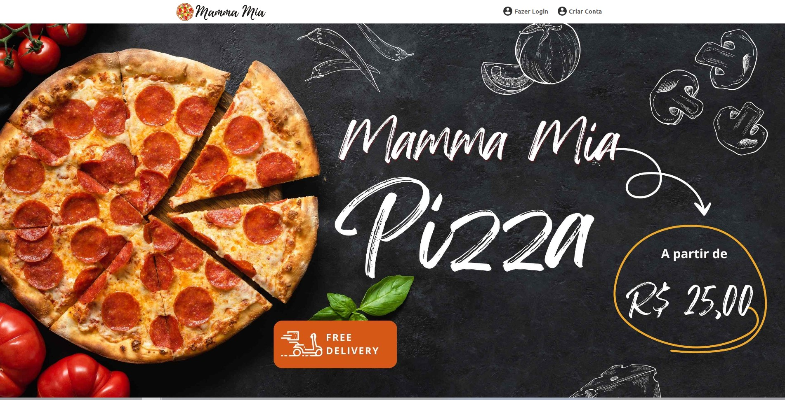

# NAVBAR PIZZARIA MAMMAMIA

## Tecnologias

- React
- CSS
- Git and Github

## Descrição

Eu criei um navbar para uma pizzaria usando React e apliquei conceitos de CSS como display flex, justify content e align items para garantir que ele seja responsivo. Também escolhi usar a fonte Ubuntu sem serifa para torná-lo ainda mais atraente e de acordo com a identidade visual da pizzaria.

O navbar é uma importante peça de design na interface de um website, pois permite que os usuários naveguem pelo site de maneira clara e intuitiva. Ao usar display flex, garanti que os elementos dentro do navbar sejam distribuídos de maneira organizada, independentemente do tamanho da tela. Além disso, a utilização de justify content e align items permitiu que o navbar se adapte a diferentes tamanhos de tela, mantendo a distribuição dos elementos correta e garantindo uma boa experiência para o usuário.

A escolha da fonte Ubuntu sem serifa também contribuiu para a aparência atraente e profissional do navbar. A fonte é clara e fácil de ler, o que é importante para garantir que os usuários possam entender as opções de navegação rapidamente.